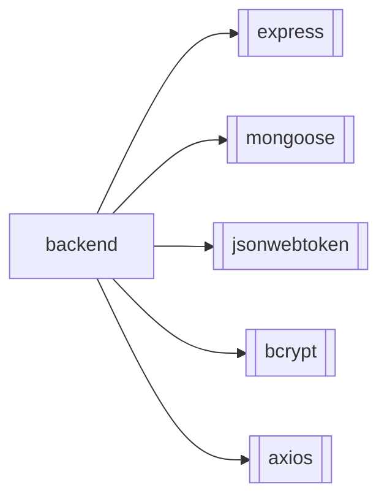
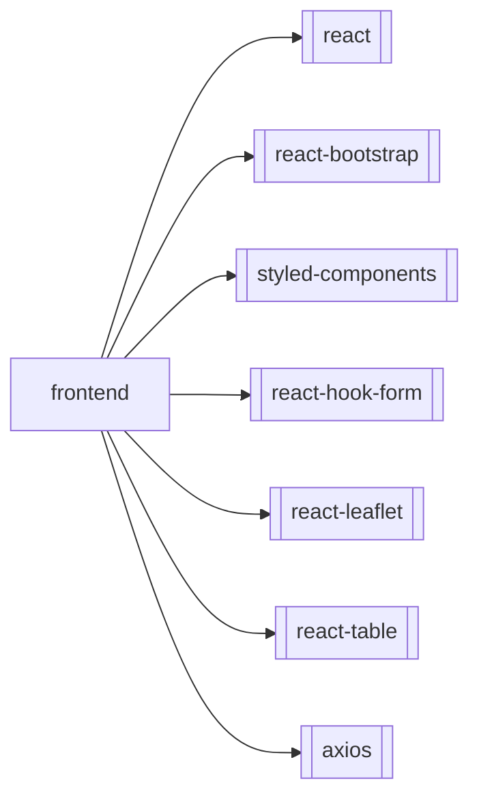

# Mapeo del Proyecto y Contexto General

---

# Project Overview

This project is a full-stack e-commerce application called YEGA. It consists of a Node.js backend and a React frontend. The application appears to be a platform that connects customers with shops, with functionality for delivery people and administrators.

## Main Technologies

### Backend

*   **Node.js:** JavaScript runtime environment.
*   **Express.js:** Web application framework for Node.js.
*   **MongoDB:** NoSQL database.
*   **Mongoose:** ODM library for MongoDB and Node.js.
*   **JSON Web Tokens (JWT):** For user authentication.
*   **Bcrypt:** For password hashing.

### Frontend

*   **React:** The core of the application.
*   **react-bootstrap:** For UI components and responsive design.
*   **styled-components:** for custom styling.
*   **react-hook-form:** Used in the `Tienda` component for form management.
*   **react-leaflet:** Used in the `Repartidor` component to display a map.
*   **react-table:** Used in the `Administrador` component for displaying a table with pagination and filtering.
*   **axios:** Used for making HTTP requests to a backend API.

## Architecture

The project is divided into two main parts: a `backend` and a `frontend`.

### Backend

The backend follows a standard Model-View-Controller (MVC) like architecture, with:

*   **`models/`:** Contains the Mongoose schemas and models for the database collections (e.g., `Producto.js`).
*   **`routes/`:** Defines the API endpoints and their corresponding logic (e.g., `productosList.js`, `usuariosLogin.js`).

There are also scripts for code generation (`generate-backend.js`, `generate-endpoint.js`), which suggests a convention of using these tools to scaffold new features.

### Frontend

The frontend is a React application with a component-based architecture. The code is structured by user roles, with each role having its own component in the `src/pages` directory:

*   `Cliente.js`: For customers.
*   `Tienda.js`: For shops/vendors.
*   `Repartidor.js`: For delivery people.
*   `Administrador.js`: For administrators.

The components are generated by a script (`generate-frontend-tasks.js`) that uses a Blackbox AI API. All components use `react-bootstrap` for layout and `styled-components` for custom styling.

# Building and Running

The project does not have `package.json` files in the root, backend, or frontend directories, so the exact commands for building and running the project are not explicitly defined. However, based on the file contents, the following commands are likely to be used:

## Backend

**Installation:**

```bash
# TODO: Create a package.json file and add dependencies.
cd backend
npm init -y
npm install express mongoose jsonwebtoken bcrypt
```

**Running the application:**

```bash
# TODO: Create a main server file (e.g., index.js or app.js)
node index.js
```

## Frontend

**Installation:**

```bash
# TODO: Create a package.json file and add dependencies.
cd frontend
npm init -y
npm install react react-dom react-bootstrap bootstrap styled-components react-hook-form react-leaflet leaflet react-table axios
```

**Running the project:**

There is no information on how to run the project. A typical command would be:

```bash
npm start
```

**NOTE:** Without `package.json` files, these commands are just suggestions.

# Development Conventions

*   **Code Generation:** The project relies heavily on AI-powered code generation scripts (`generate-backend.js`, `generate-frontend-tasks.js`, `generate-endpoint.js`). It is recommended to use these scripts to maintain consistency when adding new features.
*   **Styling:** The frontend uses `styled-components` with a defined color palette (black background, white text, silver and gold accents).
*   **Mock Data:** The frontend components currently use mock data defined directly in the files. This will need to be replaced with API calls to the backend.
*   **Authentication:** The backend uses JWT for authentication. The frontend will need to implement logic to handle tokens.
*   **API Design:** The backend API is designed to be RESTful.

---

# Análisis de Contexto: backend

## 1. Resumen Funcional

- Este directorio contiene el servidor backend de la aplicación YEGA, una plataforma de e-commerce.
- Gestiona la lógica de negocio, la autenticación de usuarios y las interacciones con la base de datos MongoDB.

## 2. Componentes Clave

| Componente | Tipo | Responsabilidad |
| --- | --- | --- |
| `models/Producto.js` | Modelo | Define el esquema de Mongoose para los productos en la base de datos. |
| `routes/productosList.js` | Ruta | Expone el endpoint `GET /productos` para listar productos con paginación y filtros. |
| `routes/usuariosLogin.js` | Ruta | Expone el endpoint `POST /usuarios/login` para la autenticación de usuarios y generación de JWT. |
| `routes/usuariosRegister.js` | Ruta | Expone el endpoint `POST /usuarios/register` para el registro de nuevos usuarios. |
| `generate-backend-tasks.js` | Script | Orquesta la generación de múltiples archivos del backend usando la API de Blackbox. |
| `generate-endpoint.js` | Script | Script de utilidad para generar un endpoint específico. |

## 3. Dependencias



## 4. Convenciones y Patrones

- **Estilo de código:** Node.js con Express.js, uso de `async/await` para operaciones asíncronas.
- **Patrones de diseño:** Arquitectura tipo MVC (Model-View-Controller) con directorios `models` y `routes`.
- **Reglas especiales:** La generación de código se realiza a través de scripts que interactúan con la API de Blackbox.

## 5. Notas para Generación de Código

- Mantener la estructura de carpetas `models` y `routes`.
- Usar los scripts `generate-*.js` para añadir nueva funcionalidad y mantener la consistencia.
- Las claves de API para servicios externos (como Blackbox) deben ser gestionadas a través de variables de entorno (`process.env.BLACKBOX_API_KEY`).
- Los nuevos endpoints deben seguir el estilo RESTful.

---

# Análisis de Contexto: frontend

## 1. Resumen Funcional

- Este directorio contiene la aplicación frontend de YEGA, construida con React.
- Proporciona la interfaz de usuario para los diferentes roles de la plataforma: `Cliente`, `Tienda`, `Repartidor` y `Administrador`.

## 2. Componentes Clave

| Componente | Tipo | Responsabilidad |
| --- | --- | --- |
| `src/pages/Cliente.js` | Página | Muestra un listado de tiendas y productos a los clientes. |
| `src/pages/Tienda.js` | Página | Permite a los dueños de tiendas gestionar el inventario de sus productos. |
| `src/pages/Repartidor.js` | Página | Muestra la lista de pedidos a los repartidores y gestiona el seguimiento de su ubicación. |
| `src/pages/Administrador.js` | Página | Permite a los administradores gestionar usuarios pendientes, con funcionalidades de paginación y búsqueda. |
| `generate-frontend-tasks.js` | Script | Orquesta la generación de múltiples componentes y páginas del frontend usando la API de Blackbox. |

## 3. Dependencias



## 4. Convenciones y Patrones

- **Estilo de código:** React con Hooks y componentes funcionales.
- **Patrones de diseño:** Component-based architecture, con una clara separación de componentes por rol de usuario en el directorio `src/pages`.
- **Styling:** Se utiliza `styled-components` para CSS-in-JS, con una paleta de colores definida (fondo negro, texto blanco, acentos en plata y oro).
- **Reglas especiales:** La generación de código se realiza a través de scripts que interactúan con la API de Blackbox.

## 5. Notas para Generación de Código

- Mantener la paleta de colores: `#000` (fondo), `#fff` (texto), `#C0C0C0` (plata), `#FFD700` (oro).
- Seguir la estructura de carpetas: `src/pages` para vistas principales por rol, `src/components` para componentes reutilizables, `src/services` para la lógica de API.
- Los nuevos componentes deben ser funcionales y utilizar React Hooks.
- Utilizar `react-bootstrap` para el layout y la responsividad.
- Las claves de API para servicios externos deben ser gestionadas a través de variables de entorno.
